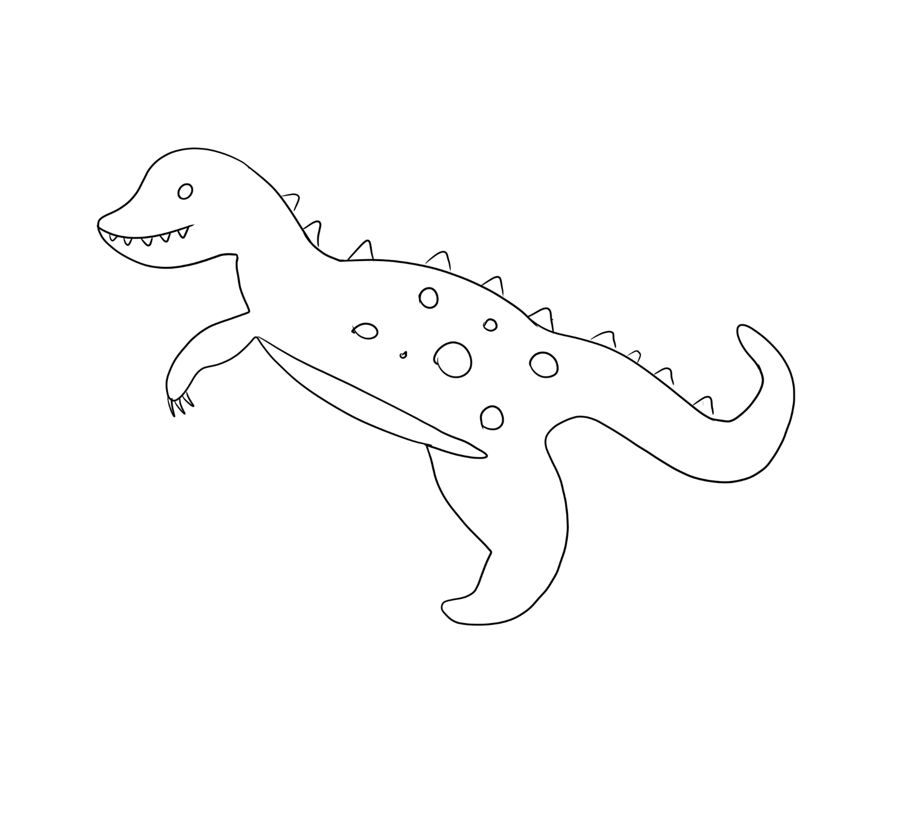

# Project Proposal

1. Roughly, what will your drawing look like?

I will draw a dinosaur with spikes.

2. What are two variables you could use so that when you change each variable, the drawing changes?
 
dinosaur_spikes-the size and placement of the spikes can change
Dinosaur_teeth-the placement of the teeth can change
Dinosaur_spots-the size and placement of the spots can change

3. Where is there repetition in your drawing?
In spots, teeth, and spikes on the dinsosaur. 

4. What are the main parts of your drawing? Are there clear sections or objects?
The main part of the drawing is the dinoasur.

5. How could you use a loop variable of a for loop? Is there somewhere in your drawing where something is repeated, but it's slightly different each time? Maybe the same object is repeated in different places, or maybe a similar object is repeated but with different sizes?

I coould use a loop variable for the spots on the dinosaur and have the spots change is shape and location. Another loop variable coud be used to make the spikes on the idnosaur have different positions. 
